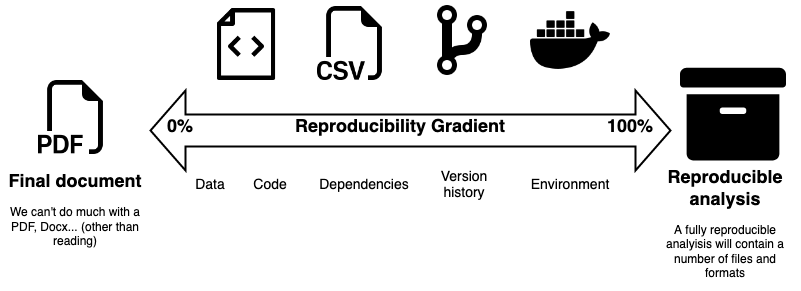
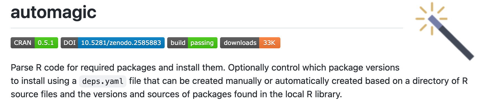
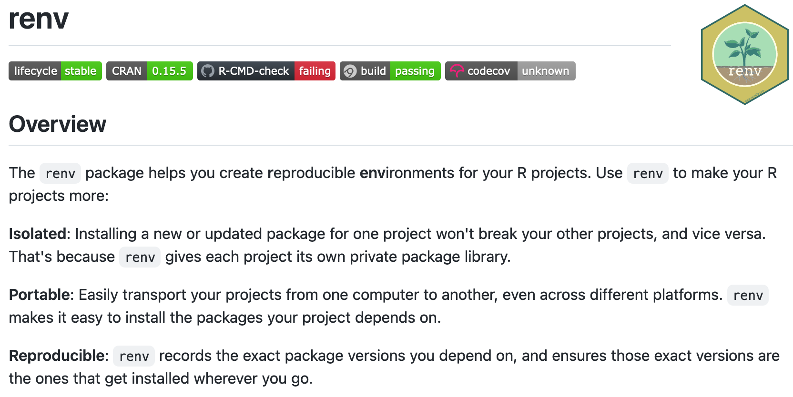
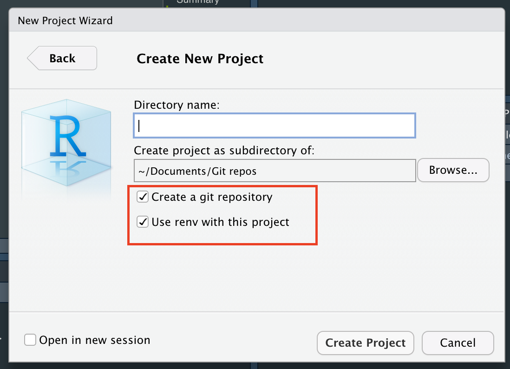
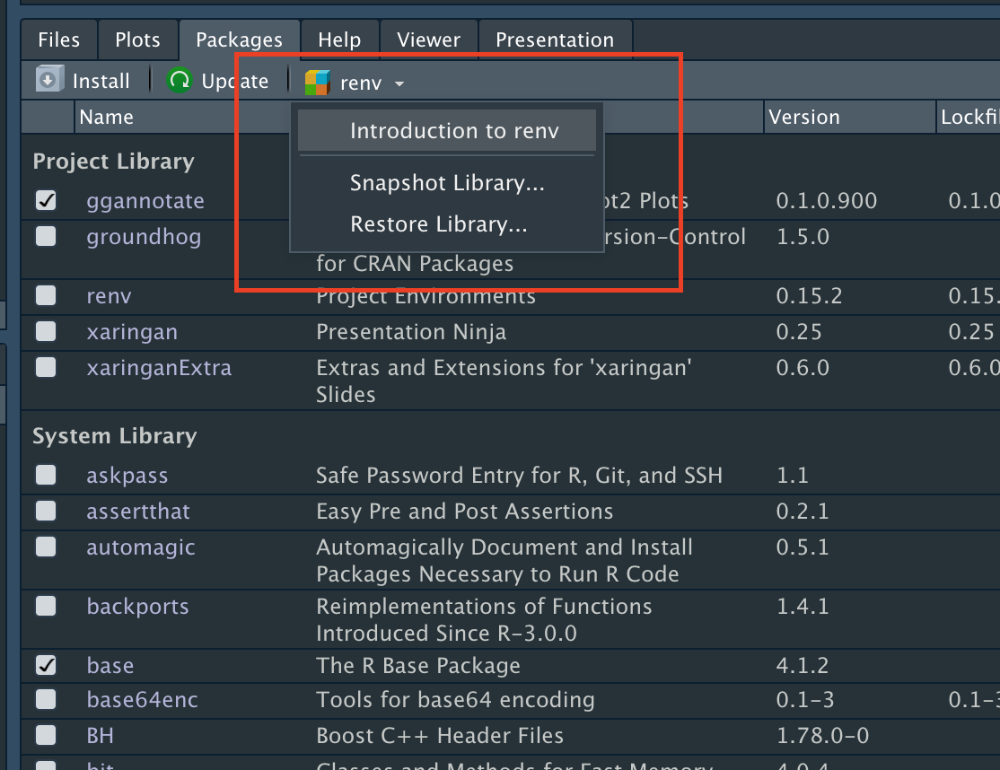

background-size: cover
background-color: black
background-image: url(https://slides.carloscamara.es/img/about-me/hackaton-cadaveres-inmobiliarios.jpg) 
background-opacity: 0.75
class: center middle slide-secondary

```{r setup, echo=FALSE}
knitr::opts_chunk$set(echo = TRUE, eval = TRUE)

# Xaringan Extra configuration. +info: https://pkg.garrickadenbuie.com/xaringanExtra
xaringanExtra::use_tile_view()
xaringanExtra::use_broadcast()
xaringanExtra::use_clipboard()
xaringanExtra::use_fit_screen() # Press ALT/Option+F
xaringanExtra::use_tachyons()
xaringanExtra::use_panelset()
xaringanExtra::use_progress_bar(color = "#3d9ed5", location = "bottom")
xaringanExtra::use_logo(
  image_url = "img/logo_small.png"
)

```


## Carlos Cámara-Menoyo 

**Senior Research Software Engineer**

Centre for Interdisciplinary Methodologies
(University of Warwick)

carlos.camara@warwick.ac.uk

https://carloscamara.es/en | [@drccamara](https://twitter.com/drccamara)

---

class: center middle slide-secondary
background-image: url(img/wrug_code_review.jpg)
background-size: contain

## Previously, in WRUG...

Iain Emsley talked about Code review 

---
class: slide-primary center middle


## Reproducibility

---
 
### What?

Replicating the same conditions of an experiment/analysis/project either to

* Recreate the same results using the same method (replication)
* Apply same method with different data (reproducibility)

--

Either case, it is not binary, but a gradient




In this session we will be focusing on the first bit: reproducing project dependencies.


---

class: slide-primary middle center

## How?

### Managing project dependencies

---

.pull-left[### Different options
Each programming language deals with managing dependencies differently

-   PHP: composer

-   Python: virtual environments, conda environments...

-   R: automagic, groundhog, renv...


But...

]


.pull-right[### Similar approach

They all share the same concept:

1.  Create a file listing dependencies used

2. Include that file within the project (`git add...`)

2.  Recreate dependencies from snapshot

3.  (optional): Update packages and update snapshot (#1)

]

---

class: interaction

## Case: reproducing this `Rmd` file

* Source code: https://github.com/ccamara/wrug-depedencies/blob/main/slides.Rmd 
* Xaringan Slides "on steroids" (i.e. `{xaringanExtra}`)  + This simple plot:

.panelset[
.panel[.panel-name[Code]

```{r echo=FALSE, fig.height=4.5, fig.width=11, message=FALSE}
library(ggplot2)
library(ggannotate)
library(tidyr)
library(dplyr)
library(lubridate)

read.csv("data/raw/google_trends_worldwide_last_year.csv") %>% 
  mutate(Week = dmy(Week)) %>% 
  pivot_longer(!Week, names_to = "package", values_to = "count") %>%
  ggplot(aes(x=Week, y=count, color=package)) +
  geom_line() +
  geom_point() +
  labs(
    title = "Evolution of Google Queries Worldwide",
    caption = "Source: Google Trends",
    y = "Number of queries", x = "", color = ""
  ) +
  scale_colour_brewer(type = "qualitative", palette = "Set1") +
  theme_minimal() +
  theme(legend.position = "top")
```


]

.panel[.panel-name[Output]

```r
library(ggplot2)
library(ggannotate)
library(tidyr)
library(dplyr)
library(lubridate)

read.csv("data/raw/google_trends_worldwide_last_year.csv") %>% 
  mutate(Week = dmy(Week)) %>% 
  pivot_longer(!Week, names_to = "package", values_to = "count") %>%
  ggplot(aes(x=Week, y=count, color=package)) +
  geom_line() +
  geom_point() +
  labs(title = "Evolution of Google Queries Worldwide",
    caption = "Source: Google Trends",
    y = "Number of queries", x = "", color = "") +
  scale_colour_brewer(type = "qualitative", palette = "Set1") +
  theme(legend.position = "top") +
  theme_minimal()
```

]
]


---

class: slide-secondary middle center

## Automagic
---




Simple, efficient approach. Easy to use: it "just works". Just 7 functions, but you will only be using 2 of them (or just one!) most of the time.

-   Developed by: Cole Brokamp [aut, cre], Steph Locke [ctb]

-   Repo: https://github.com/cole-brokamp/automagic 
 
-   Available in CRAN


---

layout: true

### Workflow

---

.panelset[
.panel[.panel-name[Option A: no `deps.yml`]

1. Install automagic: `install.packages('automagic')`
1. Run `automagic::automagic()` to 
  2. detect used packages scanning every `*.R ` and `*.Rmd` files
  3. install their .highlight[last version *from CRAN*].
2. That's all!

]

.panel[.panel-name[Option B: with `deps.yml`]

1.  Install automagic: `install.packages('automagic')`
1.  Run `automagic::make_deps_file()` to generate a yaml file called `deps.yaml` with your dependencies:

  ```yaml
  # This is a fragment of how deps.yml may look like:
  - Package: ggplot2
    Repository: CRAN
    Version: 3.3.5
  - Package: remotes
    Repository: CRAN
    Version: 2.4.2
  - Package: ggannotate
    GithubUsername: mattcowgill
    GithubRepo: ggannotate
    GithubRef: HEAD
    GithubSHA1: 926a22f2db904d9dc21636d839061cd552b55044
  
  ```

3. Include `deps.yml` in your project (`git add deps.yml`)
2. Run `automagic::automagic()` to automagically install the packages .highlight[and versions] specified in `deps.yaml.`

]
]

---

class: center middle

#### Adding/Updating packages

~~WASH~~ Add new package / update package

~~RINSE~~ Generate/update `deps.yml`

~~REPEAT~~ Run `automagic()`

---

layout:false

### Wrap up

.pull-left[
**Pros:**

-   It does what promised (name makes justice!)

-   Small package, few commands

-   Packages are shared between different R projects

    -   Saves disk space
]

-- 

.pull-right[
**Cons:**

-   Packages **and versions** are .highlight[shared between projects]

    -   No way go get different versions for different projects (hello, [`groundhog`](https://groundhogr.com), hello [`checkpoint`](https://github.com/RevolutionAnalytics/checkpoint))

-   Requires automagic previously installed to make it work:

    -   circular referencing ?
]


---

class: slide-secondary middle center

## Renv

---
class: middle

.pull-left[

]

.pull-right[
-   Developed by RStudio team: well integrated and supported

-   Repo: https://github.com/rstudio/renv/
 
-   Available in CRAN
-   Replaces packrat
]


---
layout: true

### Workflow

---


  
.pull-left[

#### 1. initiate `{renv}`

Will add/modify several files and folders to our project to make it work with renv (i.e. `.gitignore`, `.Rprofile`...)

2. Run `renv::init()`, or:
2. Within RStudio
  1. File\New Project... 
  2. Project's options 
  
.bg-washed-green.b--dark-green.ba.bw2.br3.shadow-5.ph4.mt5[
* Every package will be installed **in a folder within the project**

]

]

.pull-right[




]


---

#### 2. Create a snapshot

.pull-left[

1. Run `renv::snapshot()` to generate a list of dependencies used in a `renv.lock` file.

.bg-washed-green.b--dark-green.ba.bw2.br3.shadow-5.ph4.mt5[
* Dependencies are generated from 
  1. calls to `library()` 
  2. calls to `require()`
  2. `DESCRIPTION`
  2. packages loaded in the environment
* `renv.lock`` will list every package and its dependencies
]

      
]

.pull-right[ 
  ```json
  {
  "R": {
    "Version": "4.1.2",
    "Repositories": [
      {
        "Name": "CRAN",
        "URL": "https://cloud.r-project.org"
      }
    ]
  },
  "Packages": {
    "renv": {
      "Package": "renv",
      "Version": "0.13.1",
      "Source": "Repository",
      "Repository": "CRAN",
      "Hash": "be02499761baab60d58b808efd08c3fc"
    }
  }
}
  ```
]


---

#### 3. Recreate the environment

Run ``renv::restore()` to restore a project's dependencies from a lockfile, as previously generated by `snapshot()`.




---
layout: false
### Wrap-up

.pull-left[
**Pros:**

-   Robust solution: dependencies are properly detected
-   Well integrated within the RStudio ecosystem and IDE
-   Great documentation and usage (_de facto_ standard )
-   Isolated environments
  -   Different versions of same packages in different projects
]

-- 

.pull-right[
**Cons:**

-   More complex than `{automagic}`
  - More steps involved
  - `renv.lock` is more verbose than `deps.yml` (825 lines vs 41)
-   More resource hungry (hard disk)
  - You may have `{dplyr}` (and all its dependencies!) installed a dozen times! 
]

---

class: slide-primary

.pull-left[

## Conclusions

* Packages (and versions!) need to be stored and shared
  * Prevent not being able to reproduce something because of missing packages
  * Makes installation easier (run one command vs having to discover missing packages because of errors)
  * Minimises the _"Works on my computer effect"_
* Several options in R
  * We've covered two of the most popular ones
* Differ from DESCRIPTION
  * No need to build any package
  * We can specify exact versions

]

--

.pull-right[

## Limitations

None of those methods are panacea:

* All these options will recreate **R packages only**
  * No external libraries needed by packages
  * No binaries (i.e., Quarto)
  * No other programming language
  * Not the whole environment (Hello, Docker, hello James Tripp ;) )
* They will fail if package is not publicly accessible 
  * Removed from CRAN or Git repo
  * No online connection
  
]

---

background-image: url(https://slides.carloscamara.es/img/thanks/raj-thank-you.gif)
class: slide-secondary center middle


---


## Questions?

]

  
  
